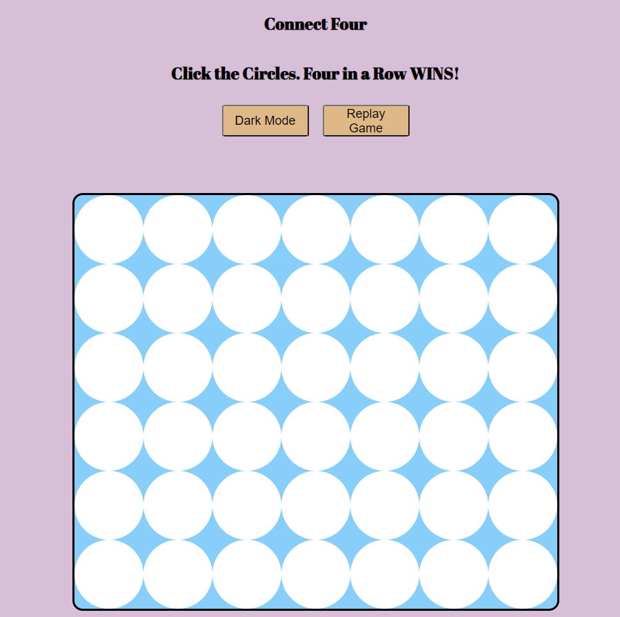

# Game Overview 

 The game we all know and love! Connect four is a two-player game where players alternate taking tokens and placing them in the board. The first player to get 4 in a row either vertically,horizontal, or diagonally wins!

# Languages 
 *HTML  
 *Javascript  
 *CSS 

 # Shoutouts 
  Google Fonts 
  [Visit website] (https://https://fonts.google.com/)

  # Add-ons 

  

# Next Steps 

* Play against a computer 
* More mobile friendly
* Add more unique styling to the game 